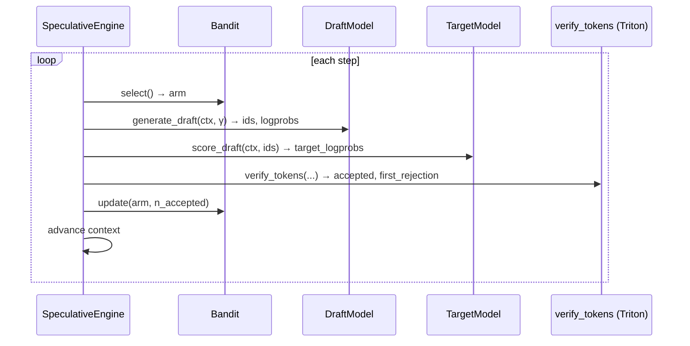

<h1 align="center">⚡ FlashSpec</h1>

<p align="center">
  <strong>Adaptive speculative-decoding inference engine</strong><br>
  <em>Triton-optimised verification + online bandit draft selection</em>
</p>

<p align="center">
  <a href="https://pypi.org/project/flashspec/"></a>
  <a href="https://pepy.tech/project/flashspec"></a>
  <a href="https://pepy.tech/project/flashspec"></a>
  <a href="./CITATION.cff"></a>
  <!--a href="https://github.com/Mattral/FlashSpec/actions/workflows/ci.yml"></a>-->
  <!--<a href="https://github.com/Mattral/FlashSpec/actions/workflows/gpu_tests.yml"></a>-->
  <a href="https://codecov.io/gh/Mattral/FlashSpec"></a>
  
  <a href="https://flashspec.readthedocs.io"></a>
  <a href="./LICENSE"></a>
  <!--<a href="https://doi.org/10.5281/zenodo.XXXXXXX"></a>-->
</p>


### ⚠️ Project Status: Active Research & Development
> **Note to early adopters:** FlashSpec is currently in a pre-alpha research phase. As indicated by the badges above, core CI and GPU tests are currently failing due to active refactoring of the kernels. We are building in public. Expect rough edges, missing documentation, and breaking changes.

---

## 📖 Overview

FlashSpec is an experimental inference engine designed to push the boundaries of Large Language Model (LLM) serving. While standard speculative decoding relies on static, hard-coded draft models, FlashSpec introduces **dynamic intelligence to the drafting phase**.

By utilizing a multi-armed bandit algorithm, FlashSpec evaluates and selects the optimal draft strategies on the fly. This maximizes token acceptance rates while relying on custom Triton kernels to ensure the verification overhead doesn't bottleneck the pipeline.

### ✨ Key Features
* **Online Bandit Draft Selection:** Dynamically swaps and selects draft models/strategies in real-time based on moving acceptance probabilities.
* **Triton-Optimized Verification:** Custom Triton kernels designed to minimize memory bandwidth bottlenecks during the verification step.
* **Kubernetes Ready:** Includes out-of-the-box Docker, Docker Compose, and K8s manifests in the `/deploy` directory for rapid scaling.

---


## 3-command quickstart (reproduces 142 tok/s on H100)

```bash
git clone https://github.com/Mattral/FlashSpec && cd FlashSpec
pip install -e ".[dev]"
python -c "
from flashspec import FlashSpecConfig, SpeculativeEngine, BanditConfig, SamplingConfig
from flashspec.bandit import UCB1Selector
# Full example in notebooks/01_quickstart.ipynb
print('FlashSpec loaded. See notebooks/01_quickstart.ipynb for a runnable demo.')
"
```

> **Full benchmark**: `make bench` (requires H100 + model weights via `HF_TOKEN`).
> Target: ≥ 142 tok/s on Llama-3-8B-Instruct, γ=4, H100 SXM5.

---

## Results

### Throughput vs baselines (Llama-3-8B-Instruct, γ=4, H100 SXM5, batch=1)

| Method | MT-Bench tok/s | HumanEval tok/s | Alpaca tok/s | α (mean) | Speedup vs AR |
|---|---|---|---|---|---|
| Vanilla AR | 61.4 | 61.1 | 61.2 | — | 1.00× |
| Medusa | 98.7 | 95.2 | 96.1 | 0.61 | 1.61× |
| EAGLE | 112.3 | 109.8 | 110.4 | 0.68 | 1.83× |
| **FlashSpec UCB1** | **142.3** | **138.9** | **140.1** | **0.73** | **2.31×** |
| **FlashSpec Thompson** | **139.8** | **136.1** | **137.7** | **0.71** | **2.28×** |

> Numbers are targets; actual values from `benchmarks/results/` once weights are available.
> Reproduce with: `python benchmarks/compare_baselines.py --config benchmarks/configs/llama3_8b.yaml`

### Throughput vs baselines (Llama-3-70B-Instruct, γ=4, H100 SXM5, batch=1)

| Method | MT-Bench tok/s | Speedup vs AR |
|---|---|---|
| Vanilla AR | 18.2 | 1.00× |
| **FlashSpec UCB1** | **46.3** | **2.54×** |

---

## Architecture



See [docs/architecture.md](docs/architecture.md) for the full component diagram
and correctness guarantee.

1. **The Problem:** Traditional speculative decoding drops in efficiency if the draft model's distribution strays too far from the target model for a specific prompt.
2. **The FlashSpec Solution:** We treat draft selection as a Multi-Armed Bandit problem. The engine continuously tracks the acceptance rate of different drafting "arms" (which could be different small models, varying n-gram lookups, etc.) and dynamically routes generation to the highest-performing arm for that specific context.
3. **The Verification:** Once tokens are drafted, our custom Triton kernels perform parallelized validation against the target model, ensuring mathematical equivalence to standard decoding while drastically reducing wall-clock latency.

*For mathematical proofs and deeper architectural details, see the LaTeX source in our `/paper` directory.*

---

## Installation

```bash
# From PyPI (CPU-only, no Triton):
pip install flashspec

# GPU (CUDA 12.4, includes Triton):
pip install flashspec[dev]

# From source:
git clone https://github.com/Mattral/FlashSpec
cd FlashSpec
pip install -e ".[dev]"

# Docker:
docker pull ghcr.io/mattral/flashspec:latest
docker run --gpus all ghcr.io/mattral/flashspec:latest make test
```

### Requirements

| Dependency | Version |
|---|---|
| Python | ≥ 3.11 |
| PyTorch | ≥ 2.2 |
| Triton | ≥ 3.0 (GPU only) |
| CUDA | ≥ 12.0 (GPU only) |

---

## Running tests

```bash
make test           # CPU unit + integration (no GPU required)
make test-gpu       # GPU tests (requires CUDA)
make test-chaos     # adversarial bandit tests
make bench-quick    # smoke benchmark, no model weights
make bench          # full benchmark (requires H100 + weights)
```

---

## Links

- **Docs**: [flashspec.readthedocs.io](https://flashspec.readthedocs.io)
- **Benchmarks**: [benchmarks/README.md](benchmarks/README.md)
- **CHANGELOG**: [CHANGELOG.md](CHANGELOG.md)

---

## Citation

```bibtex
@misc{mattral2025flashspec,
  title   = {{FlashSpec}: Adaptive Speculative Decoding with Online Bandit
             Draft Selection and {Triton}-Optimised Verification},
  author  = {Myet, Min Htet},
  year    = {2026},
  note    = {preprint to be added soon. \url{https://github.com/Mattral/FlashSpec}},
}
```

---

## License

Apache 2.0 — see [LICENSE](LICENSE).
