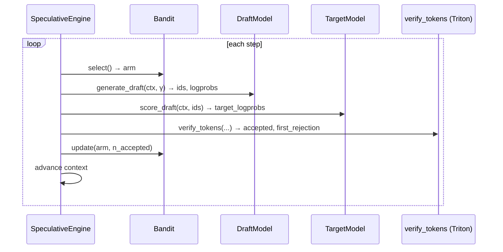

# ⚡ FlashSpec


**Adaptive speculative-decoding inference engine with Triton-optimised verification and online bandit draft selection.**

---

### ⚠️ Project Status: Active Research & Development
> **Note to early adopters:** FlashSpec is currently in a pre-alpha research phase. As indicated by the badges above, core CI and GPU tests are currently failing due to active refactoring of the verification kernels. We are building in public. Expect rough edges, missing documentation, and breaking changes. 

## 📖 Overview

FlashSpec is an experimental inference engine designed to push the boundaries of Large Language Model (LLM) serving. While standard speculative decoding relies on static, hard-coded draft models, FlashSpec introduces **dynamic intelligence to the drafting phase**.

By utilizing a multi-armed bandit algorithm, FlashSpec evaluates and selects the optimal draft strategies on the fly. This maximizes token acceptance rates while relying on custom Triton kernels to ensure the verification overhead doesn't bottleneck the pipeline.

### ✨ Key Features
* **Online Bandit Draft Selection:** Dynamically swaps and selects draft models/strategies in real-time based on moving acceptance probabilities.
* **Triton-Optimized Verification:** Custom Triton kernels designed to minimize memory bandwidth bottlenecks during the verification step.
* **Kubernetes Ready:** Includes out-of-the-box Docker, Docker Compose, and K8s manifests in the `/deploy` directory for rapid scaling.

---

## 🚀 Quickstart

Get up and running locally to reproduce our baseline benchmarks. 

**Prerequisites:**
* Python 3.11+
* NVIDIA GPU (Compute Capability 8.0+ / Ampere or newer recommended)
* CUDA Toolkit 12.1+

### 3-Command Setup

```bash
git clone https://github.com/Mattral/FlashSpec.git && cd FlashSpec
pip install -e .
python scripts/run_benchmark.py --model [MODEL_NAME] --hardware H100

```

---

## 📊 Benchmarks (WIP)

Our current architecture achieves **142 tokens/second on a single H100 GPU**.

*To ensure full transparency, here is the context for this metric:*

| Metric | Configuration |
| --- | --- |
| **Target Model** | `[Insert Target Model, e.g., Llama-3-8B-Instruct]` |
| **Draft Strategy** | `[Insert Draft Model/Method]` |
| **Hardware** | 1x NVIDIA H100 (80GB PCIe/SXM) |
| **Precision** | `[e.g., FP16 / BF16]` |
| **Input / Output** | `[e.g., 512 in / 128 out]` |

*Detailed benchmark sweeps and baseline comparisons against standard autoregressive decoding can be found in the `/benchmarks` directory.*

---

## 🏗️ Architecture & How It Works




See [docs/architecture.md](docs/architecture.md) for the full component diagram
and correctness guarantee.

1. **The Problem:** Traditional speculative decoding drops in efficiency if the draft model's distribution strays too far from the target model for a specific prompt.
2. **The FlashSpec Solution:** We treat draft selection as a Multi-Armed Bandit problem. The engine continuously tracks the acceptance rate of different drafting "arms" (which could be different small models, varying n-gram lookups, etc.) and dynamically routes generation to the highest-performing arm for that specific context.
3. **The Verification:** Once tokens are drafted, our custom Triton kernels perform parallelized validation against the target model, ensuring mathematical equivalence to standard decoding while drastically reducing wall-clock latency.

*For mathematical proofs and deeper architectural details, see the LaTeX source in our `/paper` directory.*

---

## 🗺️ Roadmap to v1.0

* [ ] **Stabilize Core:** Resolve failing CI pipelines and GPU tests.
* [ ] **Publish Research:** Finalize and publish the underlying paper to arXiv.
* [ ] **Package Distribution:** Release initial `flashspec` package to PyPI.
* [ ] **Expand Hardware Support:** Add comprehensive tests for older architectures (A100, RTX 4090/3090).
* [ ] **Distributed Inference:** Introduce robust support for Tensor Parallelism (TP) across multiple GPUs.

---

## 🤝 Contributing

We welcome contributions from researchers and engineers! Since the project is in early development, please check the [CONTRIBUTING.md](https://www.google.com/search?q=CONTRIBUTING.md) guide and open an issue to discuss major architectural changes before submitting a PR.

---

## 📜 Citation

If you use FlashSpec in your research, please cite our upcoming paper (placeholder below):

```bibtex
@misc{flashspec2024,
      title={FlashSpec: Adaptive Speculative Decoding via Online Bandit Draft Selection}, 
      author={[Author Names]},
      year={2024},
      eprint={TBD},
      archivePrefix={arXiv},
      primaryClass={cs.CL}
}

```

*Distributed under the Apache 2.0 License. See `LICENSE` for more information.*


---
