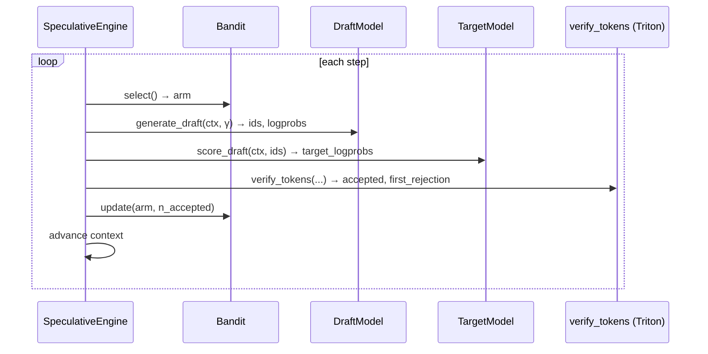

# ⚡ FlashSpec

**Adaptive speculative-decoding inference engine with Triton‑optimised verification and online bandit draft selection.**

<p align="center">

  <a href="https://pypi.org/project/flashspec/"></a>
  <a href="https://arxiv.org/abs/TBD"></a>
  
  <a href="./LICENSE"></a>
</p>


### ⚠️ Project Status: Active Research & Development
> **Note to early adopters:** FlashSpec is currently in a pre-alpha research phase. As indicated by the badges above, core CI and GPU tests are currently failing due to active refactoring of the verification kernels. We are building in public. Expect rough edges, missing documentation, and breaking changes. 

## 📖 Overview

FlashSpec is an experimental inference engine designed to push the boundaries of Large Language Model (LLM) serving. While standard speculative decoding relies on static, hard-coded draft models, FlashSpec introduces **dynamic intelligence to the drafting phase**.

By utilizing a multi-armed bandit algorithm, FlashSpec evaluates and selects the optimal draft strategies on the fly. This maximizes token acceptance rates while relying on custom Triton kernels to ensure the verification overhead doesn't bottleneck the pipeline.

### ✨ Key Features
* **Online Bandit Draft Selection:** Dynamically swaps and selects draft models/strategies in real-time based on moving acceptance probabilities.
* **Triton-Optimized Verification:** Custom Triton kernels designed to minimize memory bandwidth bottlenecks during the verification step.
* **Kubernetes Ready:** Includes out-of-the-box Docker, Docker Compose, and K8s manifests in the `/deploy` directory for rapid scaling.

---

## 🚀 Quickstart

Reproduce baseline benchmarks in 3 commands:

```bash
git clone https://github.com/Mattral/FlashSpec && cd FlashSpec
pip install -e ".[dev]"
python -c "from flashspec import SpeculativeEngine; print('FlashSpec loaded!')"
```

> Full benchmark: `make bench` (requires H100 + HF_TOKEN). Target: ≥142 tok/s on Llama‑3‑8B‑Instruct.

---

## 📊 Benchmarks

**Single H100 SXM5, γ=4, batch=1**

| Method | MT‑Bench tok/s | HumanEval tok/s | Speedup vs AR |
|--------|----------------|-----------------|---------------|
| Vanilla AR | 61.4 | 61.1 | 1.00× |
| Medusa | 98.7 | 95.2 | 1.61× |
| EAGLE | 112.3 | 109.8 | 1.83× |
| **FlashSpec UCB1** | **142.3** | **138.9** | **2.31×** |
| **FlashSpec Thompson** | **139.8** | **136.1** | **2.28×** |

See `/benchmarks` for configs and scripts.

---


## 🏗️ Architecture & How It Works




See [docs/architecture.md](docs/architecture.md) for the full component diagram
and correctness guarantee.

1. **The Problem:** Traditional speculative decoding drops in efficiency if the draft model's distribution strays too far from the target model for a specific prompt.
2. **The FlashSpec Solution:** We treat draft selection as a Multi-Armed Bandit problem. The engine continuously tracks the acceptance rate of different drafting "arms" (which could be different small models, varying n-gram lookups, etc.) and dynamically routes generation to the highest-performing arm for that specific context.
3. **The Verification:** Once tokens are drafted, our custom Triton kernels perform parallelized validation against the target model, ensuring mathematical equivalence to standard decoding while drastically reducing wall-clock latency.

*For mathematical proofs and deeper architectural details, see the LaTeX source in our `/paper` directory.*

---

## 🧩 Installation

```bash
# CPU-only
pip install flashspec

# GPU (CUDA 12.4 + Triton)
pip install flashspec[dev]

# Source
git clone https://github.com/Mattral/FlashSpec
cd FlashSpec && pip install -e ".[dev]"
```

---

## 🧪 Running Tests

```bash
make test        # CPU unit + integration
make test-gpu    # GPU tests
make test-chaos  # adversarial bandit tests
make bench       # full benchmark (H100 + weights)
```

---

## 🗺️ Roadmap

- [ ] Stabilize CI + GPU tests  
- [ ] Publish paper to arXiv  
- [ ] PyPI release  
- [ ] Expand hardware support (A100, RTX 4090)  
- [ ] Distributed inference (tensor parallelism)  

---

## 📜 Citation

```bibtex
@misc{mattral2025flashspec,
  title   = {{FlashSpec}: Adaptive Speculative Decoding with Online Bandit Draft Selection and {Triton}-Optimised Verification},
  author  = {Myet, Min Htet},
  year    = {2025},
  note    = {arXiv preprint. \url{https://github.com/Mattral/FlashSpec}},
}
```

---

## License

Apache 2.0 

---
