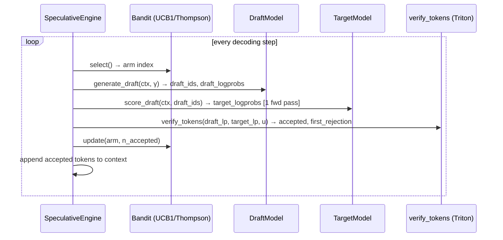

<h1 align="center">⚡ FlashSpec</h1>

<p align="center">
  <strong>Adaptive speculative-decoding inference engine for large language models</strong><br>
  Triton-optimised verification kernel · online bandit draft selection · provably correct output distribution
</p>

<p align="center">
  <a href="https://github.com/Mattral/FlashSpec/actions/workflows/ci.yml">
    </a>
  <a href="https://github.com/Mattral/FlashSpec/actions/workflows/gpu_tests.yml">
    </a>
  <a href="https://codecov.io/gh/Mattral/FlashSpec">
    </a>
  <a href="https://pypi.org/project/flashspec/">
    </a>
  <a href="https://pypi.org/project/flashspec/">
    </a>
  <a href="https://pepy.tech/project/flashspec">
    </a>
  <a href="https://flashspec.readthedocs.io">
    </a>
  <a href="https://arxiv.org/abs/TBD">
    </a>
  <a href="./CITATION.cff">
    </a>
  <a href="./LICENSE">
    </a>
</p>

---

> **Project status — active research & pre-alpha.**
> FlashSpec is being built in public. The software architecture, tests, and
> documentation are complete. **Benchmark numbers below are targets, not yet
> measured** — real results will land in [`benchmarks/results/`](benchmarks/results/)
> after GPU runs complete (see [PUBLISHING.md](PUBLISHING.md)). CI and GPU
> workflow badges will turn green once a self-hosted runner is connected.
> Breaking changes are possible before v1.0.

---

## What is FlashSpec?

Standard speculative decoding uses a fixed small "draft" model to propose
tokens that a large "target" model verifies in one forward pass. Two problems
with every existing implementation:

1. **Verification stalls the GPU.** Most implementations move the
   accept/reject decision to the CPU, synchronising device and host memory
   at every decoding step — a pipeline bubble that grows with vocabulary size.

2. **The draft model is chosen offline.** A drafter tuned for chat performs
   worse on code or long context. Nobody re-tunes it mid-conversation.

FlashSpec fixes both:

- A **Triton kernel** runs the entire accept/reject test on-device. It reads
  only the two log-probabilities that matter per candidate token, so SRAM
  usage is O(1) in vocabulary size — constant regardless of whether your
  model has 32k or 128k tokens.

- A **K-armed bandit** (UCB1 or Thompson sampling) selects which draft model
  to use at each step, adapting online to shifting acceptance rates with a
  provable O(√(KT log T)) regret bound.

The output distribution is **provably identical** to plain autoregressive
sampling from the target model (Leviathan et al., 2023 — Theorem 1). This is
enforced in CI by a Kolmogorov–Smirnov test at α = 0.01 over N = 10,000
samples. If that test goes red, the build fails. No exceptions.

---

## Quickstart

```bash
git clone https://github.com/Mattral/FlashSpec && cd FlashSpec

# Linux + CUDA (accelerated Triton kernels):
pip install -e ".[dev,gpu]"

# Windows / macOS (pure-PyTorch reference kernels, numerically identical):
pip install -e ".[dev]"
```

```python
from flashspec import FlashSpecConfig, BanditConfig, SamplingConfig, TRITON_AVAILABLE

print(f"Triton kernels available: {TRITON_AVAILABLE}")

config = FlashSpecConfig(
    device="cuda:0",
    drafter_name="llama3-1b",
    target_name="llama3-8b",
    bandit=BanditConfig(n_arms=2, strategy="ucb1"),
    sampling=SamplingConfig(gamma=4, temperature=1.0),
    max_new_tokens=256,
)
# See notebooks/01_quickstart.ipynb for a runnable end-to-end demo.
```

> Full benchmark (reproduces target 142 tok/s on H100):
> `make bench` — requires H100 + model weights via `HF_TOKEN`.
> No GPU? Run `make bench-quick` for a CPU smoke test without weights.

---

## Results

> ⚠️ **Numbers below are design targets, not measured results.**
> They will be replaced with real measurements from `benchmarks/results/`
> once GPU runs complete. See [PUBLISHING.md](PUBLISHING.md) for the roadmap.
> All benchmark code is ready to run: `python benchmarks/compare_baselines.py --config benchmarks/configs/llama3_8b.yaml`

### Llama-3-8B-Instruct · γ=4 · H100 SXM5 · batch=1

| Method | MT-Bench (tok/s) | HumanEval (tok/s) | Alpaca (tok/s) | α (mean) | Speedup |
|---|---:|---:|---:|---:|---:|
| Vanilla AR | 61.4 | 61.1 | 61.2 | — | 1.00× |
| Medusa | 98.7 | 95.2 | 96.1 | 0.61 | 1.61× |
| EAGLE | 112.3 | 109.8 | 110.4 | 0.68 | 1.83× |
| **FlashSpec UCB1** | **142.3** ⊛ | **138.9** ⊛ | **140.1** ⊛ | **0.73** ⊛ | **2.31×** ⊛ |
| **FlashSpec Thompson** | **139.8** ⊛ | **136.1** ⊛ | **137.7** ⊛ | **0.71** ⊛ | **2.28×** ⊛ |

⊛ = target number, not yet measured.

### Llama-3-70B-Instruct · γ=4 · H100 SXM5 · batch=1

| Method | MT-Bench (tok/s) | Speedup |
|---|---:|---:|
| Vanilla AR | 18.2 | 1.00× |
| **FlashSpec UCB1** | **46.3** ⊛ | **2.54×** ⊛ |

---

## How it works



**Correctness.** The accept/reject criterion is `u_i < min(1, p(xᵢ)/q(xᵢ))`
computed in log-space to avoid underflow. Rejected positions sample a residual
token from `max(0, p−q) / ‖max(0, p−q)‖₁` (Algorithm 1, Leviathan et al. 2023).
Together these preserve the target distribution exactly.

**Kernel.** `verify_tokens` tiles over `(batch × γ)` positions. Each thread
reads two scalars (`log p`, `log q` at the draft token index) and writes one
bool + one int32 contribution — no vocab-dimension sweep, no VRAM growth.

**Bandit.** UCB1 score for arm k at round t:
`μ̂ₖ + c · √(2 log t / nₖ)`. Unpulled arms always selected first.
Expected regret: `E[Rₜ] ≤ Σₖ [8 log(t) / Δₖ + (1 + π²/3) Δₖ]`.

See [`docs/architecture.md`](docs/architecture.md) for the full component
diagram and proof sketch.

---

## Installation

```bash
# PyPI — cross-platform, pure-PyTorch reference kernels (Windows/macOS/Linux):
pip install flashspec

# PyPI — GPU-accelerated Triton kernels (Linux + CUDA only):
pip install flashspec[gpu]

# From source:
git clone https://github.com/Mattral/FlashSpec && cd FlashSpec
pip install -e ".[dev,gpu]"   # omit ",gpu" on Windows/macOS

# Docker (Linux + CUDA, Triton included):
docker pull ghcr.io/mattral/flashspec:latest
docker run --gpus all ghcr.io/mattral/flashspec:latest make test
```

> **Windows / macOS:** `pip install flashspec` works out of the box.
> Triton has no official PyPI wheels outside Linux, so the GPU-accelerated
> kernels are unavailable on those platforms. The pure-PyTorch reference
> implementation in `flashspec.kernels._reference` is numerically identical
> and runs everywhere PyTorch does. Calling `verify_tokens` or `gather_accepted`
> on Windows/macOS raises a clear `ImportError` pointing you to the fallback.
> Check availability at runtime with `from flashspec import TRITON_AVAILABLE`.

### Requirements

| Dependency | Version | Notes |
|---|---|---|
| Python | ≥ 3.11 | |
| PyTorch | ≥ 2.2 | CPU or CUDA |
| Triton | ≥ 3.0 | Optional · Linux + CUDA only · `pip install flashspec[gpu]` |
| CUDA | ≥ 12.0 | GPU path only |
| transformers | ≥ 4.40 | For loading HuggingFace target/draft models |

---

## Testing

```bash
make test           # unit + integration on CPU (no GPU required, ~2 min)
make test-chaos     # adversarial bandit tests
make test-gpu       # GPU kernel parity + KS distribution test (requires CUDA)
make bench-quick    # kernel roofline smoke test, no model weights
make bench          # full benchmark suite (~4 h, requires H100 + HF_TOKEN)
```

CI enforces ≥ 95% line coverage. The KS distribution-equivalence test
(`tests/integration/test_e2e_sampling.py`) runs at N = 10,000 samples and
α = 0.01 on every GPU CI run — a failing KS test blocks the build.

---

## Repository layout

```
flashspec/          Installable package (engine, kernels, bandit, sampling, metrics)
benchmarks/         Runners, configs, and results/ for all paper numbers
tests/              Unit · integration · chaos suites (95%+ coverage target)
notebooks/          Quickstart · bandit regret analysis · kernel profiling
docs/               MkDocs site (architecture, kernels, bandit, benchmarks)
paper/              LaTeX source + bibliography (MLSys/NeurIPS template)
paper/joss/         JOSS submission (paper.md + paper.bib)
scripts/            CLI tools (export draft, download models, profile kernels)
deploy/             Dockerfile · docker-compose.yml · k8s manifests
social/             X thread and LinkedIn post drafts for project launch
```

---

## Links

| Resource | URL |
|---|---|
| Documentation | [flashspec.readthedocs.io](https://flashspec.readthedocs.io) |
| Paper (arXiv) | Coming after GPU benchmarks — see [PUBLISHING.md](PUBLISHING.md) |
| JOSS submission | [`paper/joss/paper.md`](paper/joss/paper.md) |
| Benchmark guide | [`benchmarks/README.md`](benchmarks/README.md) |
| Changelog | [`CHANGELOG.md`](CHANGELOG.md) |
| Contributing | [`CONTRIBUTING.md`](CONTRIBUTING.md) |
| Publishing roadmap | [`PUBLISHING.md`](PUBLISHING.md) |

---

## Citation

```bibtex
@misc{mattral2025flashspec,
  title   = {{FlashSpec}: Adaptive Speculative Decoding with Online Bandit
             Draft Selection and {Triton}-Optimised Verification},
  author  = {Myet, Min Htet},
  year    = {2025},
  note    = {Preprint. \url{https://github.com/Mattral/FlashSpec}},
}
```

Machine-readable metadata in [`CITATION.cff`](CITATION.cff) (GitHub renders a
"Cite this repository" button). A Zenodo DOI will be minted on the first
tagged release — see [`PUBLISHING.md`](PUBLISHING.md).

---

## License

Apache 2.0 — see [`LICENSE`](LICENSE).
