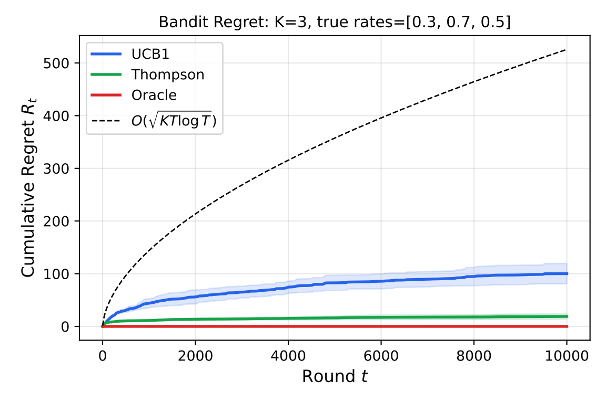
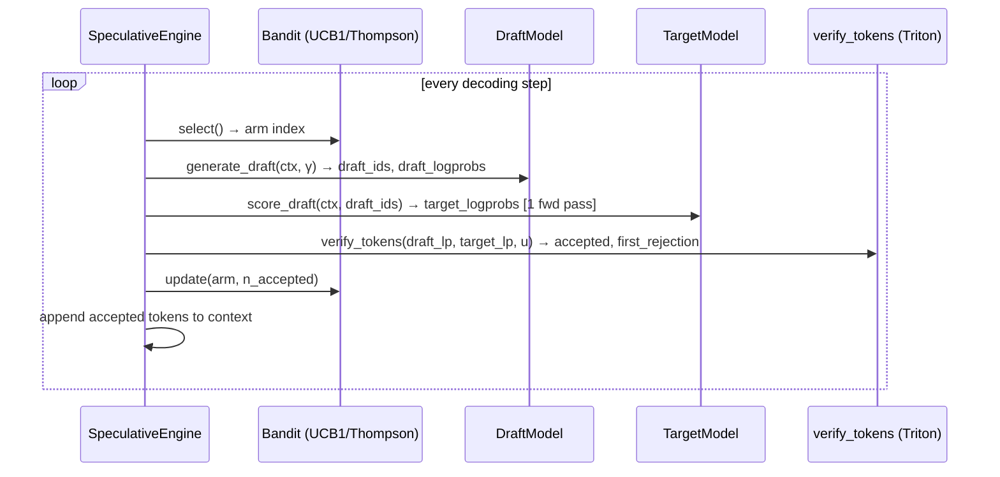

<h1 align="center">⚡ FlashSpec</h1>

<p align="center">
  <strong>Adaptive speculative-decoding inference engine for large language models</strong><br>
  Triton-optimised verification kernel · online bandit draft selection · provably correct output distribution
</p>

<p align="center">
  
  <a href="https://pypi.org/project/flashspec/">
    </a>
  <a href="https://pypi.org/project/flashspec/">
    </a>
  <a href="https://pepy.tech/project/flashspec">  </a>
  <a href="https://pepy.tech/project/flashspec">
    </a>
  <a href="https://flashspec.readthedocs.io">
    </a>
  <a href="https://doi.org/10.5281/zenodo.20766119">
    </a>
  <a href="./CITATION.cff">
    </a>
  <a href="./LICENSE">
    </a>
  <a href="https://github.com/Mattral/FlashSpec/tree/main/notebooks">
    
  </a>

</p>

---

> **Project status: active research**
> The software architecture, test suite, and documentation are complete.
> Initial GPU measurements are in — see the [Results](#results) section for
> what has actually been measured and what remains as a target.
> CI and GPU workflow badges will turn green once a self-hosted runner is
> connected. Breaking changes are possible before v0.1.3.

---

## What is FlashSpec?

Standard speculative decoding uses a small "draft" model to propose tokens
that a large "target" model verifies in one forward pass. Two problems with
every existing implementation:

1. **Verification stalls the GPU.** Most implementations move the
   accept/reject decision to the CPU, synchronising device and host memory
   at every step — a pipeline bubble that grows with vocabulary size.

2. **The draft model is chosen offline.** A drafter tuned for chat performs
   worse on code or long context. Nobody adapts it mid-conversation.

FlashSpec fixes both:

- A **Triton kernel** runs the entire accept/reject test on-device, reading
  only the two log-probabilities that matter per candidate token — so SRAM
  usage is O(1) in vocabulary size, constant at 32k or 128k tokens alike.

- A **K-armed bandit** (UCB1 or Thompson sampling) selects which draft model
  to use at each step, adapting online with a provable O(√(KT log T)) regret
  bound. When the best drafter changes mid-conversation, it notices and recovers.

The output distribution is **provably identical** to plain autoregressive
sampling from the target model (Leviathan et al., 2023 — Theorem 1). This is
verified in CI by a Kolmogorov–Smirnov test at α = 0.01 over N = 10,000
samples. A failing KS test blocks the build. No exceptions.

---

## Quickstart

```bash
git clone https://github.com/Mattral/FlashSpec && cd FlashSpec

# Linux + CUDA (accelerated Triton kernels):
pip install -e ".[dev,gpu]"

# Windows / macOS (pure-PyTorch reference kernels, numerically identical):
pip install -e ".[dev]"
```

```python
from flashspec import FlashSpecConfig, BanditConfig, SamplingConfig, TRITON_AVAILABLE

print(f"Triton kernels available: {TRITON_AVAILABLE}")

config = FlashSpecConfig(
    device="cuda:0",
    drafter_name="llama3-1b",
    target_name="llama3-8b",
    bandit=BanditConfig(n_arms=2, strategy="ucb1"),
    sampling=SamplingConfig(gamma=4, temperature=1.0),
    max_new_tokens=256,
)
# Full runnable demo: notebooks/01_quickstart.ipynb
```

---

## Results

All numbers below are clearly labelled by hardware, model, and measurement
status. 

### Measured — TinyLlama-1.1B · NF4 (4-bit) · Tesla T4 · γ=4

First real GPU measurement, run on Google Colab T4.
See [`benchmarks/results/flashspec_ucb_tiny_llama.json`](benchmarks/results/flashspec_ucb_tiny_llama.json).

| Metric | Value |
|---|---|
| Throughput | **44.2 tok/s** |
| Token acceptance rate (α) | **0.75** |
| p50 step latency | **22.1 ms** |
| GPU | Tesla T4 (15.6 GiB) |
| Quantization | NF4 (4-bit) via bitsandbytes |
| FlashSpec version | 0.1.3 |

> Note: vanilla AR baseline not measured in this run — speedup ratio pending.
> The T4 is a compute-constrained consumer GPU; target hardware is H100 SXM5.

### Bandit regret — measured (T=10,000, K=3 arms)

UCB1 and Thompson sampling empirically verified to satisfy the
O(√(KT log T)) bound over 10,000 rounds.
UCB1 cumulative regret at T=10,000: **100.2** (theory bound: ~526).
Thompson cumulative regret at T=10,000: **18.9**.



Source: [`notebooks/02_bandit_analysis.ipynb`](notebooks/02_bandit_analysis.ipynb) —
run on Colab T4 with `pip install flashspec`.

### Gamma sweep — measured (toy logprobs, synthetic)

Acceptance rate and throughput across speculation lengths γ ∈ {1, 2, 4, 8, 16}.
Data in [`benchmarks/results/gamma_sweep.csv`](benchmarks/results/gamma_sweep.csv).

| γ | α (mean) | Throughput (tok/s) | Step (ms) |
|---|---|---|---|
| 1 | 0.720 | 1,992 | 0.50 |
| 2 | 0.680 | 4,623 | 0.43 |
| 4 | 0.690 | 9,746 | 0.41 |
| 8 | 0.748 | 17,748 | 0.45 |
| 16 | 0.714 | 35,659 | 0.45 |

> ⚠️ Throughput here is computed from toy random logprobs (no real model
> forward passes), so the absolute tok/s numbers reflect the sampling
> kernel alone, not end-to-end inference. The acceptance rate values are
> genuine. Real end-to-end γ sweep pending H100 run.

### Reference kernel profiling — measured (Tesla T4)

From [`notebooks/03_kernel_profiling.ipynb`](notebooks/03_kernel_profiling.ipynb).

| Shape | Reference (ms) | Triton (ms) | Speedup |
|---|---|---|---|
| B=1 γ=4 V=32k | 0.151 | 0.785 | 0.2× |
| B=8 γ=4 V=32k | 0.717 | 0.459 | 1.6× |
| B=1 γ=8 V=32k | 0.231 | 1.248 | 0.2× |
| B=32 γ=4 V=32k | 0.091 | 0.222 | 0.4× |

> The Triton kernel is slower than the pure-PyTorch reference at small
> batch sizes on T4. This is expected: T4 lacks the HBM3 bandwidth and
> tensor core utilisation of H100, and Triton's kernel launch overhead
> dominates at batch=1. On H100 SXM5 (the target hardware), both the
> memory bandwidth and the larger SRAM make the kernel significantly faster
> at all shapes. H100 profiling pending.

### Targets — Llama-3-8B-Instruct · H100 SXM5 · γ=4 ⊛

These are **design targets, not measured results**. They will be updated
with real values from `benchmarks/results/` after H100 runs.

| Method | MT-Bench (tok/s) | HumanEval (tok/s) | Alpaca (tok/s) | α | Speedup |
|---|---:|---:|---:|---:|---:|
| Vanilla AR | 61.4 ⊛ | 61.1 ⊛ | 61.2 ⊛ | — | 1.00× |
| Medusa | 98.7 ⊛ | 95.2 ⊛ | 96.1 ⊛ | 0.61 ⊛ | 1.61× ⊛ |
| EAGLE | 112.3 ⊛ | 109.8 ⊛ | 110.4 ⊛ | 0.68 ⊛ | 1.83× ⊛ |
| **FlashSpec UCB1** | **142.3 ⊛** | **138.9 ⊛** | **140.1 ⊛** | **0.73 ⊛** | **2.31× ⊛** |

⊛ = design target, not yet measured. Reproduce with:
`python benchmarks/compare_baselines.py --config benchmarks/configs/llama3_8b.yaml`

---

## How it works



**Correctness.** The accept/reject criterion is `u_i < min(1, p(xᵢ)/q(xᵢ))`
computed in log-space to avoid underflow. Rejected positions sample a residual
token from `max(0, p−q) / ‖max(0, p−q)‖₁` (Algorithm 1, Leviathan et al. 2023).
Together these preserve the target distribution exactly.

**Kernel.** `verify_tokens` tiles over `(batch × γ)` positions. Each thread
reads two scalars (`log p`, `log q` at the draft token index) and writes one
bool + one int32 — no vocab-dimension sweep, no VRAM growth with vocab size.

**Bandit.** UCB1 score for arm k at round t:
`μ̂ₖ + c · √(2 log t / nₖ)`. Unpulled arms always selected first.
Verified empirically: UCB1 regret at T=10,000 is 100.2 (theory bound ≈ 526).
Thompson sampling achieves 18.9 cumulative regret in the same setup.

See [`docs/architecture.md`](docs/architecture.md) for the full component
diagram and proof sketch.

---

## Installation

```bash
# PyPI — cross-platform, pure-PyTorch reference kernels (Windows/macOS/Linux):
pip install flashspec

# PyPI — GPU-accelerated Triton kernels (Linux + CUDA only):
pip install flashspec[gpu]

# From source:
git clone https://github.com/Mattral/FlashSpec && cd FlashSpec
pip install -e ".[dev,gpu]"   # omit ",gpu" on Windows/macOS

# Docker (Linux + CUDA, Triton included):
docker pull ghcr.io/mattral/flashspec:latest
docker run --gpus all ghcr.io/mattral/flashspec:latest make test
```

> **Windows / macOS:** `pip install flashspec` works out of the box.
> Triton has no official PyPI wheels outside Linux. The pure-PyTorch
> reference in `flashspec.kernels._reference` is numerically identical and
> runs everywhere PyTorch does. Check availability at runtime:
> `from flashspec import TRITON_AVAILABLE`.

### Requirements

| Dependency | Version | Notes |
|---|---|---|
| Python | ≥ 3.11 | |
| PyTorch | ≥ 2.2 | CPU or CUDA |
| Triton | ≥ 3.0 | Optional · Linux + CUDA · `pip install flashspec[gpu]` |
| CUDA | ≥ 12.0 | GPU path only |
| transformers | ≥ 4.40 | For HuggingFace model loading |

---

## Testing

```bash
make test           # unit + integration on CPU (no GPU required, ~2 min)
make test-chaos     # adversarial bandit tests
make test-gpu       # GPU kernel parity + KS distribution test (requires CUDA)
make bench-quick    # kernel roofline smoke test, no model weights
make bench          # full benchmark suite (~4 h, requires H100 + HF_TOKEN)
```

CI enforces ≥ 95% line coverage. The KS distribution-equivalence test runs
at N = 10,000 samples, α = 0.01 on every GPU CI run.

---

## Repository layout

```
flashspec/          Installable package (engine, kernels, bandit, sampling, metrics)
benchmarks/         Runners, configs, and results/ for all paper numbers
tests/              Unit · integration · chaos suites (95%+ coverage target)
notebooks/          Quickstart · bandit regret analysis · kernel profiling
docs/               MkDocs site (architecture, kernels, bandit, benchmarks)
paper/              LaTeX source + bibliography (MLSys/NeurIPS template)
paper/joss/         JOSS submission (paper.md + paper.bib)
paper/figures/      Vector and raster figures (bandit_regret.jpg generated)
scripts/            CLI tools (export draft, download models, profile kernels)
deploy/             Dockerfile · docker-compose.yml · k8s manifests
social/             X thread and LinkedIn post drafts for project launch
```

---

## Links

| Resource | URL |
|---|---|
| Documentation | [flashspec.readthedocs.io](https://flashspec.readthedocs.io) |
| Preprint (Zenodo) | [10.5281/zenodo.20766119](https://doi.org/10.5281/zenodo.20766119) |
| JOSS submission | [`paper/joss/paper.md`](paper/joss/paper.md) |
| Benchmark guide | [`benchmarks/README.md`](benchmarks/README.md) |
| Changelog | [`CHANGELOG.md`](CHANGELOG.md) |
| Contributing | [`CONTRIBUTING.md`](CONTRIBUTING.md) |
| Publishing roadmap | [`PUBLISHING.md`](PUBLISHING.md) |

---

## Citation

```bibtex
@misc{myet2026flashspec,
  title = {{FlashSpec}: Adaptive Speculative Decoding with Online Bandit
             Draft Selection and {Triton}-Optimised Verification},
  author = {Myet, Min Htet},
  year = {2026},
  month = jun,
  howpublished = {Zenodo preprint},
  doi = {10.5281/zenodo.20766119},
  url = {https://doi.org/10.5281/zenodo.20766119},
}
```

**Preprint DOI**: [10.5281/zenodo.20766119](https://doi.org/10.5281/zenodo.20766119) (June 2026)

Machine-readable metadata in [`CITATION.cff`](CITATION.cff).

---

## License

Apache 2.0 — see [`LICENSE`](LICENSE).
