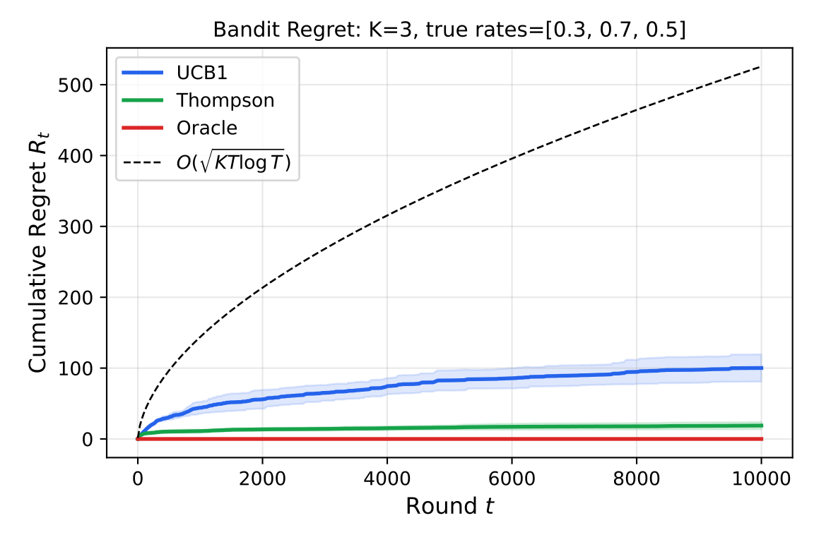
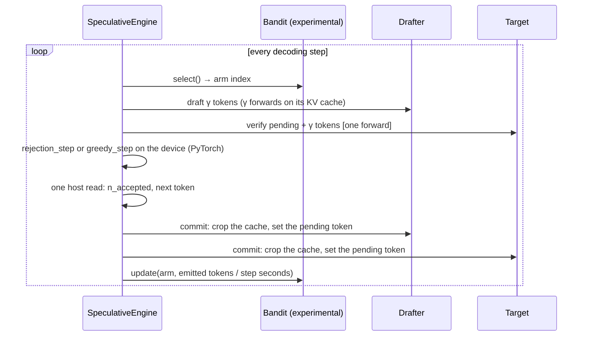

<h1 align="center">⚡ FlashSpec</h1>

<p align="center">
  <strong>Lossless speculative decoding for HuggingFace causal language models</strong><br>
  Algorithm 1 rejection sampling and exact greedy · static KV cache + CUDA graphs on CUDA · experimental bandit and kernels
</p>

<p align="center">
  
  <a href="https://pypi.org/project/flashspec/">
    </a>
  <a href="https://pypi.org/project/flashspec/">
    </a>
  <a href="https://pypi.org/project/flashspec/">
    </a>
  <a href="https://flashspec.readthedocs.io">
    </a>
  <a href="https://doi.org/10.5281/zenodo.20766119">
    </a>
  <a href="./CITATION.cff">
    </a>
  <a href="./LICENSE">
    </a>
  <a href="https://github.com/Mattral/FlashSpec/tree/main/notebooks">
    
  </a>

</p>

---

**Project status: alpha.** PyPI ships 0.1.5. `main` holds the unreleased
0.2.0 work this README describes.

**What was measured, and only this:** one model pair
(`Qwen/Qwen2.5-1.5B-Instruct` verified by `Qwen/Qwen2.5-0.5B-Instruct`),
one Tesla T4, fp16, batch 1, 10 MT-Bench and 10 HumanEval prompts, with
the compiled path on (`FlashSpecConfig.compile`: static KV cache and CUDA
graphs). On that setup FlashSpec was faster than HuggingFace `generate`
compiled the same way in every cell of the table below. With the eager
path (compile off), it was slower than plain HuggingFace `generate` in 7
of the 8 cells of the earlier GPU run (two model pairs, greedy and
T = 0.7; generated table further down). No other GPU, model pair or batch
size has been measured. Every H100 number in the docs is a design target.

- **Correctness** is checked in CI on CPU: a chi-squared test that emitted
  tokens follow the target when draft and target differ, and a
  token-for-token comparison of greedy output with
  `generate(do_sample=False)`. On the GPU in fp16, kernels for different
  shapes can round differently, so each greedy GPU run reports how many
  prompts matched (last columns of the table).
- **The bandit is experimental.** Every measured run used one drafter, so
  the selector has never been measured choosing between drafters.
- **The Triton and assembly kernels are experimental** and not on the
  generation critical path; see [Experimental kernels](#experimental-kernels-not-on-the-critical-path).
- `sampling.variant="typical"` is **lossy**; `"rejection"` and `"greedy"`
  are the lossless variants.

This is a single-device library plus a small HTTP server, not a
production serving stack.

<!-- BEGIN GENERATED: status (scripts/ingest_gpu_bundle.py) -->
Measured at git `52993e4`: `Qwen/Qwen2.5-1.5B-Instruct` verified by `Qwen/Qwen2.5-0.5B-Instruct`, Tesla T4, fp16, batch 1, gamma 4, 10 prompts per set (chat template), 128 new tokens. One model pair, one GPU. Speedups are medians of per-prompt ratios within the same run. The headline baseline is HuggingFace `generate` with a static cache compiled the same way (CUDA graphs); eager HuggingFace and assisted generation are context. Cells are the stored JSON values.

| dataset | mode | FlashSpec tok/s | compiled HF tok/s | **vs compiled HF** | eager HF tok/s | vs eager HF | vs HF assisted | acceptance | c (compiled) | greedy match vs eager HF |
|---|---|---|---|---|---|---|---|---|---|---|
| humaneval | greedy | 72.82514637900351 | 49.12146246181767 | **1.4858433502745476** | 23.47412238102048 | 3.07061233431369 | 3.266906470700773 | 0.7674472295086122 | 0.47729950026754264 | 9/10 |
| humaneval | T=0.7 | 64.65023157407026 | 49.040621806485035 | **1.320689325997725** | 23.737994536255016 | 2.7423863913637065 | 3.3484703254583867 | 0.7018560004266362 | 0.47093952934629857 | n/a |
| mt_bench | greedy | 55.252001625954684 | 49.12532116486909 | **1.1245701242847757** | 23.397178479769785 | 2.379455989273368 | 3.2676885098898643 | 0.5310738087770345 | 0.4727048901148993 | 10/10 |
| mt_bench | T=0.7 | 55.877849299137125 | 48.94843360467012 | **1.1410430525952333** | 22.970064276527687 | 2.4026007789116655 | 4.0319731142311515 | 0.5374968568894605 | 0.47490476916347535 | n/a |
<!-- END GENERATED: status -->

---

## What is FlashSpec?

Speculative decoding lets a small "draft" model propose γ tokens that a
larger "target" model checks in one forward pass. FlashSpec's batch-1
step is:

1. the drafter proposes γ tokens (γ incremental forwards on its KV cache);
2. the target runs **one** forward over the pending token(s) plus the γ
   drafts;
3. the accept/reject test runs on the device in PyTorch: Leviathan et al.
   Algorithm 1 rejection sampling at temperature > 0, or the longest
   prefix that matches the target's argmax at temperature 0 (greedy);
4. one device-to-host read per step returns the accept count and the next
   token, and both caches are cropped by integer bookkeeping.

On CUDA with Triton available, `FlashSpecConfig.compile` runs that loop on
static KV caches and replays the fixed-shape drafter decode and target
verify calls as CUDA graphs (`torch.compile(mode="reduce-overhead")`).

Two parts are experimental. The UCB1/Thompson selector can choose between
registered drafters, but it has only been measured with one. The Triton
verification kernels and the optional assembly residual are not called on
the generation path (see
[Experimental kernels](#experimental-kernels-not-on-the-critical-path)).

On finite probabilities the output distribution follows Leviathan et al.,
2023, Theorem 1. The CI check is a chi-squared test on discrete token ids.
`tests/integration/test_output_distribution.py` uses fixed pairs with
draft distribution `q` different from target distribution `p`, at gamma
1 and gamma 4. It compares the first emitted token to `p`, and, when
gamma is 4, the second emitted token as well. N is 30,000 and the
vocabulary is 6, so each expected count stays above 5. The critical
value is the chi-square 1% point for 5 degrees of freedom, 15.086. The
same check runs on the PyTorch residual and on a kernel that implements
the same formula. An engine test uses a toy target whose next token
depends on the previous token and compares the first two generated
tokens with sampling from that target. `tests/integration/test_e2e_sampling.py`
is the gamma 1 case where the draft equals the target, so every draft
token is accepted. It does not exercise the residual. A failing
chi-squared test fails the suite.

---

## Quickstart

```bash
git clone https://github.com/Mattral/FlashSpec && cd FlashSpec

# Linux + CUDA (accelerated Triton kernels):
pip install -e ".[dev,gpu]"

# Windows / macOS (pure-PyTorch reference kernels, numerically identical):
pip install -e ".[dev]"

# Optional CPU residual kernel (Linux x86-64, flashspec-asm-kernel>=0.1.2;
# other platforms install nothing):
pip install -e ".[asm]"

# Optional single-device HTTP server:
pip install -e ".[serve]"
```

```python
import torch
from transformers import AutoModelForCausalLM, AutoTokenizer
from flashspec import FlashSpecConfig, BanditConfig, SamplingConfig, TRITON_AVAILABLE
from flashspec.bandit import UCB1Selector
from flashspec.engine import SpeculativeEngine, TargetModel, load_drafters

print(f"Triton kernels available: {TRITON_AVAILABLE}")

# Public checkpoints. Both report vocab_size 32000.
# Llama-3 reports vocab_size 128256. Do not pair it with this drafter.
drafter_id = "Felladrin/Llama-160M-Chat-v1"
target_id = "TinyLlama/TinyLlama-1.1B-Chat-v1.0"

config = FlashSpecConfig(
    device="cpu",
    dtype="float32",
    drafter_name=drafter_id,
    target_name=target_id,
    bandit=BanditConfig(n_arms=1, strategy="ucb1"),
    sampling=SamplingConfig(gamma=4, temperature=1.0),
    max_new_tokens=16,
)
# TargetModel(hub_id, device) passes device_map and needs accelerate,
# which this package does not depend on. Load the weights here and inject
# them, which is what benchmarks/harness.py does.
drafter_module = AutoModelForCausalLM.from_pretrained(
    drafter_id, torch_dtype=torch.float32
).to(config.device)
target_module = AutoModelForCausalLM.from_pretrained(
    target_id, torch_dtype=torch.float32
).to(config.device)
drafter_module.eval()
target_module.eval()
drafters = load_drafters(
    [drafter_id],
    device=config.device,
    dtype=torch.float32,
    temperature=config.sampling.temperature,
    models={drafter_id: drafter_module},
)
target = TargetModel(
    target_id,
    torch.device(config.device),
    torch.float32,
    model=target_module,
)
engine = SpeculativeEngine(
    config,
    drafters,
    target,
    UCB1Selector(n_arms=1, window_size=config.bandit.window_size),
)
tokenizer = AutoTokenizer.from_pretrained(target_id)
prompt = tokenizer("The capital of France is", return_tensors="pt").input_ids
result = engine.generate(prompt, max_new_tokens=16)
new_ids = result.output_ids[0]
new_ids = new_ids[new_ids != -1]
print(tokenizer.decode(new_ids, skip_special_tokens=True))
```

Both checkpoints are public. `benchmarks/harness.py` refuses a drafter and a target whose vocabulary sizes differ and writes no result file. `SpeculativeEngine` itself does not apply that check. `notebooks/01_quickstart.py` is a separate CPU toy: the names are `"toy"`, the log-probs are random, and it does not download these checkpoints. With one drafter the bandit cannot adapt, and the loader says so.

---

## Results

The generated GPU blocks show the stored JSON values. The hand-written
tables below them use three significant figures; the JSON and CSV files
keep full precision. Each figure is classified in
[`benchmarks/results/PROVENANCE.md`](benchmarks/results/PROVENANCE.md).
Commands and file names are in
[`benchmarks/results/README.md`](benchmarks/results/README.md).

### Measured — GPU, real prompts (MT-Bench and HumanEval, chat template)

This block is generated by `scripts/ingest_gpu_bundle.py` from the result
JSONs of a validated bundle (`benchmarks/results/gpu/<commit>/`). Do not
edit it by hand.

<!-- BEGIN GENERATED: gpu-results (scripts/ingest_gpu_bundle.py) -->
#### `Qwen/Qwen2.5-1.5B-Instruct` verified, `Qwen/Qwen2.5-0.5B-Instruct` drafting

GPU Tesla T4 · torch 2.11.0+cu130 · gamma 4 · 32 result files · git `36134c0`, `52993e4`. Prompts: chat_template; n per row: 10. Cells are the stored JSON values, not rounded.

| dataset | mode | method | tok/s median | tok/s p25 | tok/s p75 | acceptance | tokens / target fwd | target fwd / token | speedup vs plain HF (median) | speedup vs compiled plain HF (median) | speedup vs hf_assisted (median) | c (step profile) | greedy match | NaN/inf logits | peak GB |
|---|---|---|---|---|---|---|---|---|---|---|---|---|---|---|---|
| humaneval | greedy | flashspec_ucb | 26.23852723249483 | 24.63765887975667 | 27.162960607917213 | 0.7748324561339393 | 4.19672131147541 | 0.24609375 | 1.0229054923869696 | n/a | 1.0601084433981502 | n/a | 10/10 | 0 | 3.831118583679199 |
| humaneval | greedy | flashspec_ucb | 23.955334966652856 | 22.118394981825364 | 24.43403990022169 | 0.7748324561339393 | 4.19672131147541 | 0.24609375 | 1.0100837739015707 | 0.48782041481421456 | 1.0609567223465555 | 0.8565146717354838 | 10/10 | 0 | 3.9242053031921387 |
| humaneval | greedy | flashspec_compiled | 72.82514637900351 | 66.56029254824399 | 74.62784772525018 | 0.7674472295086122 | 4.169381107491857 | 0.24765625 | 3.07061233431369 | 1.4858433502745476 | 3.266906470700773 | 0.49268634551456664 | 9/10 | n/a | 3.9391956329345703 |
| humaneval | greedy | hf_greedy | 25.747536265737693 | 25.667860736052027 | 25.94495327957157 | n/a | 1.0078740157480315 | 1.0 | n/a | n/a | n/a | n/a | n/a | 0 | 3.8375372886657715 |
| humaneval | greedy | hf_greedy | 23.47412238102048 | 23.227123999475463 | 23.77857377434369 | n/a | 1.0078740157480315 | 1.0 | n/a | n/a | n/a | n/a | n/a | 0 | 3.9314565658569336 |
| humaneval | greedy | hf_greedy_compiled | 49.12146246181767 | 49.063005875735676 | 49.28637488375219 | n/a | 1.0078740157480315 | 1.0 | n/a | n/a | n/a | n/a | 9/10 | n/a | 3.9255499839782715 |
| humaneval | greedy | hf_assisted | 24.67250490527404 | 22.646022509962553 | 25.612035488652108 | n/a | 7.231638418079096 | 0.14609375 | n/a | n/a | n/a | n/a | 10/10 | 0 | 3.9205241203308105 |
| humaneval | greedy | hf_assisted | 22.237121132281878 | 20.731428317512226 | 23.083469585054274 | n/a | 7.231638418079096 | 0.14609375 | n/a | n/a | n/a | n/a | 10/10 | 0 | 4.012396335601807 |
| humaneval | T=0.7 | flashspec_ucb | 22.994806388294748 | 21.758612773754045 | 25.17813966076342 | 0.7036410816413052 | 3.8323353293413174 | 0.26875 | 0.9143376283741449 | n/a | 1.1413036574151052 | n/a | n/a | 0 | 3.8405613899230957 |
| humaneval | T=0.7 | flashspec_ucb | 20.926996555037533 | 19.006980713893356 | 22.107230498003904 | 0.6882722339966006 | 3.710144927536232 | 0.27734375 | 0.8889351997557875 | 0.4261660719179908 | 1.0763259822470552 | 0.853002896534031 | n/a | 0 | 3.945862293243408 |
| humaneval | T=0.7 | flashspec_compiled | 64.65023157407026 | 58.88331145207276 | 67.30609587744007 | 0.7018560004266362 | 3.764705882352941 | 0.2734375 | 2.7423863913637065 | 1.320689325997725 | 3.3484703254583867 | 0.5004567116939009 | n/a | n/a | 3.945862293243408 |
| humaneval | T=0.7 | hf_sample | 25.401692277734487 | 25.188006318909956 | 25.52414674099085 | n/a | 1.0078740157480315 | 1.0 | n/a | n/a | n/a | n/a | n/a | 0 | 3.840813636779785 |
| humaneval | T=0.7 | hf_sample | 23.737994536255016 | 23.581683402366696 | 23.790908382598783 | n/a | 1.0078740157480315 | 1.0 | n/a | n/a | n/a | n/a | n/a | 0 | 3.9465904235839844 |
| humaneval | T=0.7 | hf_sample_compiled | 49.040621806485035 | 48.91420681457233 | 49.127526309195396 | n/a | 1.0078740157480315 | 1.0 | n/a | n/a | n/a | n/a | n/a | n/a | 3.939551830291748 |
| humaneval | T=0.7 | hf_assisted | 19.75492333430464 | 17.68724539958827 | 22.51555521260074 | n/a | 6.2745098039215685 | 0.1671875 | n/a | n/a | n/a | n/a | n/a | 0 | 3.9224438667297363 |
| humaneval | T=0.7 | hf_assisted | 18.252091267763525 | 17.25533897621466 | 20.413537204874352 | n/a | 6.037735849056604 | 0.1734375 | n/a | n/a | n/a | n/a | n/a | 0 | 4.025937080383301 |
| mt_bench | greedy | flashspec_ucb | 19.263895987077582 | 17.876720942167275 | 19.932220650397593 | 0.5308389674229258 | 3.176178660049628 | 0.32265625 | 0.7528549865839097 | n/a | 1.073667645549547 | n/a | 9/10 | 0 | 3.8356237411499023 |
| mt_bench | greedy | flashspec_ucb | 17.848947424797554 | 17.05064438910831 | 19.216907014764494 | 0.5868378012374362 | 3.2653061224489797 | 0.3140625 | 0.7712457435366594 | 0.36444516173510544 | 1.082497949211112 | 0.8492848578085832 | 9/10 | 0 | 3.905423641204834 |
| mt_bench | greedy | flashspec_compiled | 55.252001625954684 | 51.03451752732001 | 56.23720752136681 | 0.5310738087770345 | 3.18407960199005 | 0.321875 | 2.379455989273368 | 1.1245701242847757 | 3.2676885098898643 | 0.4888912681940854 | 10/10 | n/a | 3.9152259826660156 |
| mt_bench | greedy | hf_greedy | 25.487991963425753 | 25.439671247202842 | 25.65189575863387 | n/a | 1.0078740157480315 | 1.0 | n/a | n/a | n/a | n/a | n/a | 0 | 3.845881938934326 |
| mt_bench | greedy | hf_greedy | 23.397178479769785 | 22.921001536069262 | 23.552116432251463 | n/a | 1.0078740157480315 | 1.0 | n/a | n/a | n/a | n/a | n/a | 0 | 3.9156312942504883 |
| mt_bench | greedy | hf_greedy_compiled | 49.12532116486909 | 48.97701107926284 | 49.21500203797986 | n/a | 1.0078740157480315 | 1.0 | n/a | n/a | n/a | n/a | 10/10 | n/a | 3.910264492034912 |
| mt_bench | greedy | hf_assisted | 19.857969448236993 | 15.308813592486892 | 22.27020365580778 | n/a | 3.8905775075987843 | 0.26484375 | n/a | n/a | n/a | n/a | 10/10 | 0 | 3.916429042816162 |
| mt_bench | greedy | hf_assisted | 18.523353839382736 | 13.817359096283546 | 19.874466083142597 | n/a | 3.8905775075987843 | 0.26484375 | n/a | n/a | n/a | n/a | 10/10 | 0 | 3.9850401878356934 |
| mt_bench | T=0.7 | flashspec_ucb | 19.856912897628682 | 18.059678676289927 | 21.612539675023445 | 0.5357908259547473 | 3.290488431876607 | 0.31171875 | 0.7713409325667324 | n/a | 1.1933850262734405 | n/a | n/a | 0 | 3.8409838676452637 |
| mt_bench | T=0.7 | flashspec_ucb | 18.051633117833564 | 16.19958313691243 | 18.82464363903081 | 0.5437414602239845 | 3.3333333333333335 | 0.3078125 | 0.7831004034693231 | 0.3684109285057109 | 1.246618707574589 | 0.8579566227564982 | n/a | 0 | 3.923186779022217 |
| mt_bench | T=0.7 | flashspec_compiled | 55.877849299137125 | 50.58062889171737 | 59.43849884307497 | 0.5374968568894605 | 3.2989690721649483 | 0.3109375 | 2.4026007789116655 | 1.1410430525952333 | 4.0319731142311515 | 0.5004025014700858 | n/a | n/a | 3.9273171424865723 |
| mt_bench | T=0.7 | hf_sample | 25.708033881186918 | 25.52976546475353 | 25.845993306023857 | n/a | 1.0078740157480315 | 1.0 | n/a | n/a | n/a | n/a | n/a | 0 | 3.8480911254882812 |
| mt_bench | T=0.7 | hf_sample | 22.970064276527687 | 22.871294494922637 | 23.08729168048587 | n/a | 1.0078740157480315 | 1.0 | n/a | n/a | n/a | n/a | n/a | 0 | 3.9295730590820312 |
| mt_bench | T=0.7 | hf_sample_compiled | 48.94843360467012 | 48.86839827300831 | 49.071253152907715 | n/a | 1.0078740157480315 | 1.0 | n/a | n/a | n/a | n/a | n/a | n/a | 3.924206256866455 |
| mt_bench | T=0.7 | hf_assisted | 14.715778555192315 | 12.989302254851275 | 19.21646429804001 | n/a | 3.78698224852071 | 0.271875 | n/a | n/a | n/a | n/a | n/a | 0 | 3.9214768409729004 |
| mt_bench | T=0.7 | hf_assisted | 13.640262305103246 | 8.678840619024454 | 16.993490021453383 | n/a | 3.9751552795031055 | 0.259375 | n/a | n/a | n/a | n/a | n/a | 0 | 4.008172988891602 |
- forward_cost (humaneval): c eager 0.8533442390730158, c compiled 0.47729950026754264
- forward_cost (humaneval): c eager 0.8751621829653458, c compiled 0.47093952934629857
- forward_cost (mt_bench): c eager 0.8910460117453463, c compiled 0.47490476916347535
- forward_cost (mt_bench): c eager 0.8973067267125661, c compiled 0.4727048901148993

#### `TinyLlama/TinyLlama-1.1B-Chat-v1.0` verified, `Felladrin/Llama-160M-Chat-v1` drafting

GPU Tesla T4 · torch 2.11.0+cu130 · gamma 4 · 12 result files · git `36134c0`. Prompts: chat_template; n per row: 10. Cells are the stored JSON values, not rounded.

| dataset | mode | method | tok/s median | tok/s p25 | tok/s p75 | acceptance | tokens / target fwd | target fwd / token | speedup vs plain HF (median) | speedup vs compiled plain HF (median) | speedup vs hf_assisted (median) | c (step profile) | greedy match | NaN/inf logits | peak GB |
|---|---|---|---|---|---|---|---|---|---|---|---|---|---|---|---|
| humaneval | greedy | flashspec_ucb | 31.250871186065634 | 29.67332081324305 | 31.730403496731114 | 0.3428825495568735 | 2.5 | 0.4078125 | 0.920824455046579 | n/a | 1.3627982299701538 | n/a | 9/10 | 0 | 3.3315539360046387 |
| humaneval | greedy | hf_greedy | 33.80787372488116 | 33.588002304518476 | 34.12714768557471 | n/a | 1.0078740157480315 | 1.0 | n/a | n/a | n/a | n/a | n/a | 0 | 3.339426040649414 |
| humaneval | greedy | hf_assisted | 22.801485829108483 | 20.90997221766804 | 23.29082343261765 | n/a | 2.644628099173554 | 0.3859375 | n/a | n/a | n/a | n/a | 10/10 | 0 | 3.357449531555176 |
| humaneval | T=0.7 | flashspec_ucb | 29.79554888577421 | 28.57163363897569 | 30.722737408248435 | 0.37814445408204117 | 2.4521072796934864 | 0.415625 | 0.8781563928644487 | n/a | 1.5265792438087513 | n/a | n/a | 0 | 3.3389954566955566 |
| humaneval | T=0.7 | hf_sample | 33.78956769887036 | 33.30730619276562 | 34.0416340840893 | n/a | 1.0078740157480315 | 1.0 | n/a | n/a | n/a | n/a | n/a | 0 | 3.3462777137756348 |
| humaneval | T=0.7 | hf_assisted | 17.487019025333403 | 13.7530429740147 | 23.568704422712038 | n/a | 2.633744855967078 | 0.3875 | n/a | n/a | n/a | n/a | n/a | 0 | 3.3656387329101562 |
| mt_bench | greedy | flashspec_ucb | 30.210543463312913 | 26.763347847207847 | 31.938117072957773 | 0.3849257507706609 | 2.4242424242424243 | 0.4203125 | 0.9063770613006314 | n/a | 1.2096862194202025 | n/a | 9/10 | 0 | 3.339047431945801 |
| mt_bench | greedy | hf_greedy | 33.96586860489057 | 33.82290284657868 | 34.12758268923611 | n/a | 1.0078740157480315 | 1.0 | n/a | n/a | n/a | n/a | n/a | 0 | 3.3504180908203125 |
| mt_bench | greedy | hf_assisted | 24.551502847019417 | 20.15396423641451 | 28.619996148281555 | n/a | 2.549800796812749 | 0.4 | n/a | n/a | n/a | n/a | 10/10 | 0 | 3.3552961349487305 |
| mt_bench | T=0.7 | flashspec_ucb | 27.690370534753658 | 26.354477514108684 | 31.13884479526491 | 0.35637230927831254 | 2.4427480916030535 | 0.4171875 | 0.8500740058459157 | n/a | 1.2956752804023388 | n/a | n/a | 0 | 3.3453612327575684 |
| mt_bench | T=0.7 | hf_sample | 33.636622481082696 | 33.08990594716871 | 34.08290521661548 | n/a | 1.0078740157480315 | 1.0 | n/a | n/a | n/a | n/a | n/a | 0 | 3.3561997413635254 |
| mt_bench | T=0.7 | hf_assisted | 22.920757315705643 | 20.03353302426056 | 24.297143585330673 | n/a | 2.4758220502901356 | 0.41171875 | n/a | n/a | n/a | n/a | n/a | 0 | 3.361243724822998 |

Speedups are medians of per-prompt ratios against the method in the same run. NaN/inf counts come from one untimed probe generation per method on the first prompt.
<!-- END GENERATED: gpu-results -->

### Measured, 0.1.5 engine — TinyLlama-1.1B-Chat float32 · CPU · γ=4 · git `f59b5b4`

One HumanEval prompt, 16 new tokens, one drafter. Speedup is below 1.

| | FlashSpec UCB | Vanilla AR |
|---|---:|---:|
| tok/s | 1.75 | 4.30 |
| latency (s) | 9.14 | 3.72 |
| acceptance | 0.114 | unmeasured |
| speedup vs AR | 0.407 | unmeasured |

### Measured, 0.1.5 engine — TinyLlama-1.1B-Chat float16 · Tesla T4 · γ=4 · git `cb02ca1`

Eight synthetic prompts, one drafter. Speedup is below 1.

| | FlashSpec UCB | Vanilla AR |
|---|---:|---:|
| tok/s | 17.6 ± 1.43 | 29.0 ± 0.757 |
| p50 latency (ms) | 1860 | 1090 |
| p95 latency (ms) | 2140 | 1170 |
| acceptance | 0.208 ± 0.00825 | unmeasured |
| speedup vs AR | 0.606 ± 0.0501 | unmeasured |
| gpu memory (GB) | 2.38 | 2.38 |

## Microbenchmarks and historical

These rows are a random network, a sampling kernel, or the historical NF4 prompt. They sit below the paired end-to-end runs. The kernel and bandit measurements are under [Experimental components](#experimental-components).

### CPU toy and residual — git `da8182b`

Random in-process network, and a PyTorch residual microbench. The toy
speedup is below 1. The bandit row is a synthetic sampler, not that network.

| | FlashSpec UCB | Vanilla AR |
|---|---:|---:|
| tok/s | 808 ± 86.4 | 2320 ± 2.51 |
| p50 latency (ms) | 10.6 | 3.44 |
| acceptance | 0.312 ± 0.0600 | unmeasured |
| speedup vs AR | 0.348 ± 0.0376 | unmeasured |

| Vocab | PyTorch residual (ms) | PyTorch verification (ms) |
|---:|---:|---:|
| 1024 | 0.0182 ± 0.000935 | 0.418 ± 0.0221 |
| 4096 | 0.0197 ± 0.000205 | 0.523 ± 0.0435 |

| Arm | Acceptance | tok/s |
|---|---:|---:|
| UCB on the switch | 0.556 | 5790 |
| Fixed A | 0.200 | 2570 |
| Fixed B | 0.200 | 3220 |
| Single-drafter control | 0.200 | 2880 |

An older notebook cell assigns 44.2 tok/s, acceptance 0.75, p50 22.1 ms; no timing log exists, so it is not used as a result.

### Gamma sweep — measured (toy logprobs, synthetic)

Acceptance rate and throughput across speculation lengths γ ∈ {1, 2, 4, 8, 16}.
Data in [`benchmarks/results/gamma_sweep.csv`](benchmarks/results/gamma_sweep.csv).

| γ | α (mean) | Throughput (tok/s) | Step (ms) |
|---|---|---|---|
| 1 | 0.720 | 1,992 | 0.50 |
| 2 | 0.680 | 4,623 | 0.43 |
| 4 | 0.690 | 9,746 | 0.41 |
| 8 | 0.748 | 17,748 | 0.45 |
| 16 | 0.714 | 35,659 | 0.45 |

> Throughput here is the sampling kernel on random log-probs. The CSV
> column `measurement_kind` is `sampling_kernel_only_random_logprobs`.
> It is not end-to-end inference and it is not an H100 result.

No H100 comparison exists, and Medusa and EAGLE are not implemented here, so no comparison with them exists.

---

## Experimental components

### Bandit (experimental, single-arm measured only)

Every language-model run in this README used one drafter, so the
selector has not been measured choosing between drafters. The regret
numbers below come from a synthetic K=3 simulation.

#### Bandit regret — measured, synthetic (T=10,000, K=3 arms)

In this simulation UCB1 and Thompson sampling stay inside the
O(√(KT log T)) bound over 10,000 rounds.
UCB1 cumulative regret at T=10,000: **100.2** (theory bound: ~526).
Thompson cumulative regret at T=10,000: **18.9**.



The figure is `paper/figures/bandit_regret.jpg`. The saved output is
`notebooks/02_bandit_analysis.ipynb` cell 3 (0-based index, execution
count 4): UCB1 100.2, Thompson 18.9, Oracle 0.0. This is a synthetic
K=3 arm experiment, not a throughput gain on a language model.

### Experimental kernels (not on the critical path)

The engine does not call these kernels. A speculative step's time is the
drafter and target forwards (milliseconds); the accept/reject test and
the residual are microseconds and run in PyTorch on the device.

- **Triton `verify_tokens` / `gather_accepted`** (`flashspec.kernels`).
  `verify_tokens` tiles over `(batch × γ)` positions; each thread reads
  two scalars (`log p`, `log q` at the draft token index) and writes one
  bool and one int32, so SRAM use does not grow with the vocabulary. It
  matches the pure-PyTorch reference numerically. There is no GPU CI
  runner: `notebooks/colab_triton_tests.py` runs the `@pytest.mark.gpu`
  parity tests on Colab and writes `colab_triton_tests.log`.
- **Assembly residual** (`flashspec-asm-kernel`, the `[asm]` extra,
  Linux x86-64). A residual evaluation is microseconds against
  millisecond model forwards, so it does not change end-to-end
  throughput.

#### Triton verification kernel vs the PyTorch reference — measured (Tesla T4)

Saved output of `notebooks/03_kernel_profiling.ipynb` cell 3 (0-based
index, execution count 4), printed there as a Tesla T4 run. At batch 1
the Triton kernel is slower than the PyTorch reference.

| Shape | Reference (ms) | Triton (ms) | Speedup |
|---|---|---|---|
| B=1 γ=4 V=32k | 0.151 | 0.785 | 0.2× |
| B=8 γ=4 V=32k | 0.717 | 0.459 | 1.6× |
| B=1 γ=8 V=32k | 0.231 | 1.248 | 0.2× |
| B=32 γ=4 V=32k | 0.091 | 0.222 | 0.4× |

> The Triton kernel is slower than the pure-PyTorch reference at batch 1
> on this T4 measurement. A faster H100 result has not been measured.
> Do not treat the H100 roofline in `docs/kernels.md` as a profile.

#### Assembly residual (`[asm]` extra) — Linux, git `4e48c55`, then git `1b0cda3`

Milliseconds, backend `asm`. Compare backends inside one run. The two runs do not repeat the same ordering.

| Vocab | PyTorch residual | C baseline | ASM residual | PyTorch verify | ASM verify |
|---:|---:|---:|---:|---:|---:|
| 1024 | 0.0118 ± 0.00599 | 0.0109 ± 0.00177 | 0.0151 ± 0.00971 | 0.366 ± 0.0209 | 0.422 ± 0.0438 |
| 4096 | 0.0116 ± 0.000285 | 0.0140 ± 0.00214 | 0.0140 ± 0.00430 | 0.495 ± 0.0218 | 0.537 ± 0.0159 |
| 32000 | 0.0302 ± 0.00818 | 0.0430 ± 0.00268 | 0.0248 ± 0.0230 | 1.28 ± 0.638 | 1.32 ± 0.658 |

| Vocab | PyTorch residual | C baseline | ASM residual | PyTorch verify | ASM verify |
|---:|---:|---:|---:|---:|---:|
| 1024 | 0.00686 ± 0.00312 | 0.00609 ± 0.000588 | 0.00806 ± 0.00108 | 0.158 ± 0.0421 | 0.164 ± 0.0305 |
| 4096 | 0.00685 ± 0.000109 | 0.00785 ± 0.000559 | 0.00872 ± 0.000941 | 0.231 ± 0.0339 | 0.250 ± 0.0390 |
| 32000 | 0.0124 ± 0.00209 | 0.0235 ± 0.00266 | 0.0151 ± 0.0187 | 0.747 ± 0.393 | 0.730 ± 0.376 |

---

## How it works

Batch-1 fast path (`variant` `"rejection"` or `"greedy"`):


```mermaid
sequenceDiagram
    participant E as SpeculativeEngine
    participant B as Bandit (experimental)
    participant D as Drafter
    participant T as Target

    loop every decoding step
        E->>B: select() → arm index
        E->>D: draft γ tokens (γ forwards on its KV cache)
        E->>T: verify pending + γ tokens [one forward]
        E->>E: rejection_step or greedy_step on the device (PyTorch)
        E->>E: one host read: n_accepted, next token
        E->>D: commit: crop the cache, set the pending token
        E->>T: commit: crop the cache, set the pending token
        E->>B: update(arm, emitted tokens / step seconds)
    end
```

**Batching.** A batch of more than one row uses the generic loop. Rows that accept different numbers of tokens finish the step at different context lengths. Each loop forwards only the largest group of rows that still share a length. Other lengths wait for a later loop. The KV cache is rolled only when that group has a single row. A larger group full-forwards. The returned tensor fills a shorter row with `-1` so the tensor is rectangular. That fill is not an attention mask. The engine does not pad unequal prompts into one masked batch.

**Correctness.** The accept/reject criterion is `u_i < min(1, p(xᵢ)/q(xᵢ))`
computed in log-space to avoid underflow. Rejected positions sample a residual
token from `max(0, p−q) / ‖max(0, p−q)‖₁` (Algorithm 1, Leviathan et al. 2023).
Together these preserve the target distribution exactly.

**Compiled path.** With `FlashSpecConfig.compile` on a CUDA device, the
drafter and target run on preallocated static KV caches; a crop moves the
write position instead of slicing tensors, and the fixed-shape decode and
verify calls replay as CUDA graphs. The prompt prefill stays eager.

**Bandit (experimental).** UCB1 score for arm k at round t:
`μ̂ₖ + c · √(2 log t / nₖ)`. Unpulled arms are selected first. The reward
is emitted tokens per step second. In a synthetic K=3 simulation UCB1
regret at T=10,000 is 100.2 (theory bound ≈ 526) and Thompson's is 18.9.
No language-model run has used more than one drafter.

See [`docs/architecture.md`](docs/architecture.md) for the full component
diagram and proof sketch.

---

## Installation

```bash
# PyPI — cross-platform (Windows/macOS/Linux):
pip install flashspec

# PyPI — adds Triton (Linux only): the experimental Triton kernels.
# Linux CUDA builds of PyTorch already ship Triton, which torch.compile
# needs for the compiled path.
pip install flashspec[gpu]

# Optional AVX2 residual kernel. The wheel is a Linux x86-64 ELF library.
# On Windows and macOS the extra installs nothing and the PyTorch residual stays selected.
pip install flashspec[asm]

# Optional single-device HTTP API (FastAPI). One GPU or CPU, no streaming.
pip install flashspec[serve]

# From source:
git clone https://github.com/Mattral/FlashSpec && cd FlashSpec
pip install -e ".[dev,gpu]"   # omit ",gpu" on Windows/macOS

# Docker (Linux + CUDA). No image is published; build it locally:
docker build -f deploy/Dockerfile -t flashspec .
docker run --gpus all flashspec make test
```

> **Windows / macOS:** `pip install flashspec` works out of the box.
> Triton has no official PyPI wheels outside Linux, so the compiled path
> and the experimental Triton kernels are Linux + CUDA only. The engine's
> accept/reject test is PyTorch and runs everywhere PyTorch does. The
> kernels' pure-PyTorch reference is `flashspec.kernels._reference`.
> Check availability at runtime: `from flashspec import TRITON_AVAILABLE`.

### Requirements

| Dependency | Version | Notes |
|---|---|---|
| Python | ≥ 3.11 | |
| PyTorch | ≥ 2.2 | CPU or CUDA |
| Triton | ≥ 3.0 | Optional · Linux + CUDA · needed by the compiled path (Linux CUDA PyTorch ships it) and the experimental kernels |
| flashspec-asm-kernel | ≥ 0.1.2, < 2 | Optional · Linux x86-64 · `pip install flashspec[asm]`. 0.1.2 ships a manylinux wheel with `libflashspec_asm.so`. |
| FastAPI, uvicorn, httpx | see `serve` extra | Optional · `pip install flashspec[serve]` |
| CUDA | ≥ 12.0 | GPU path only |
| transformers | ≥ 4.40 | For HuggingFace model loading |

The `asm` extra installs `flashspec-asm-kernel` >= 0.1.2 and < 2 on Linux
x86-64. Release 0.1.2 is a manylinux wheel that contains
`libflashspec_asm.so`. Release 0.1.0 was an sdist with no shared library.
An import error, or an `OSError` from `abi_version()`, keeps the
pure-PyTorch residual. A residual evaluation is microseconds, and a model
forward is milliseconds, so this kernel does not change end-to-end
throughput. `benchmarks/results/residual_linux_gha.json` and
`benchmarks/results/residual_linux_gha_1b0cda3.json` are source builds
from the flashspec-asm repo, not a timing of the 0.1.2 wheel.
The PyPI project `flashspec` at version 0.1.2 was yanked by the maintainer.
Do not install `flashspec==0.1.2`. That yank does not apply to
`flashspec-asm-kernel`.

---

## Testing

```bash
make test           # unit + integration on CPU (no GPU required, ~2 min)
make test-chaos     # adversarial bandit tests
make test-gpu       # pytest -m gpu; needs CUDA. This repository has no GPU runner.
make bench-quick    # sampling-kernel smoke test, no model weights, writes no result file
make bench-cpu      # residual microbench, synthetic bandit demo, tiny_cpu.yaml
make bench          # runs every config in benchmarks/configs; skips any checkpoint this machine cannot load
```

The distribution check in the suite is a chi-squared test
(`tests/integration/test_output_distribution.py`, N = 30,000, vocabulary 6,
critical value 15.086 at 5 degrees of freedom and α = 0.01). It is not a
Kolmogorov–Smirnov test. The CPU test job runs it. Pytest fails under 83%
line coverage, the measured unit-and-integration coverage rounded down.
`mypy --strict` is not part of the green lint job.

---

## Repository layout

```
flashspec/          Installable package (engine, kernels, bandit, sampling, metrics)
benchmarks/         Runners, configs, and results/ for all paper numbers
tests/              Unit · integration · chaos suites (83% coverage floor)
notebooks/          Quickstart · bandit regret analysis · kernel profiling
docs/               MkDocs site (architecture, kernels, bandit, benchmarks)
paper/              Draft Zenodo preprint (article class) and bibliography
paper/joss/         JOSS-format draft, not under review
paper/figures/      Vector and raster figures (bandit_regret.jpg generated)
scripts/            CLI tools (export draft, download models, profile kernels)
deploy/             Dockerfile · docker-compose.yml · k8s manifests
```

---

## Links

| Resource | URL |
|---|---|
| Documentation | [flashspec.readthedocs.io](https://flashspec.readthedocs.io) |
| Preprint (Zenodo) | [10.5281/zenodo.20766119](https://doi.org/10.5281/zenodo.20766119) |
| Draft preprint | [`paper/flashspec.tex`](paper/flashspec.tex) |
| JOSS draft | [`paper/joss/paper.md`](paper/joss/paper.md) |
| Benchmark guide | [`benchmarks/README.md`](benchmarks/README.md) |
| Changelog | [`CHANGELOG.md`](CHANGELOG.md) |
| Contributing | [`CONTRIBUTING.md`](CONTRIBUTING.md) |
| Publishing roadmap | [`PUBLISHING.md`](PUBLISHING.md) |
| Postponed work | [`docs/postponed.md`](docs/postponed.md) |

---

## Citation

```bibtex
@misc{myet2026flashspec,
  title = {{FlashSpec}: Adaptive Speculative Decoding with Online Bandit
             Draft Selection and {Triton}-Optimised Verification},
  author = {Myet, Min Htet},
  year = {2026},
  month = jun,
  howpublished = {Zenodo preprint},
  doi = {10.5281/zenodo.20766119},
  url = {https://doi.org/10.5281/zenodo.20766119},
}
```

**Preprint DOI**: [10.5281/zenodo.20766119](https://doi.org/10.5281/zenodo.20766119) (June 2026). That record is the citable archive. [`paper/flashspec.tex`](paper/flashspec.tex) is a later draft (October 2026, software 0.1.5) and has not been deposited.

Machine-readable metadata in [`CITATION.cff`](CITATION.cff).

---

## License

Apache 2.0 — see [`LICENSE`](LICENSE).
