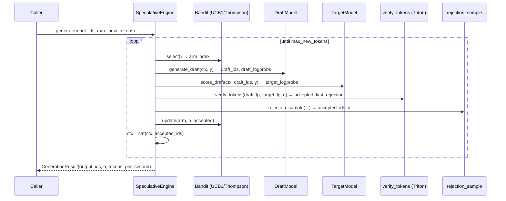
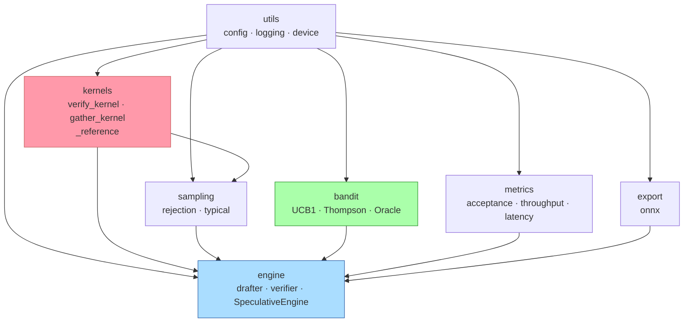

# FlashSpec Architecture

## Overview

FlashSpec is an adaptive speculative-decoding inference engine with three
orthogonal innovations over prior work:

1. **Triton-optimised verification** — batched token acceptance in a single
   kernel call; O(SRAM) independent of vocabulary size.
2. **Online bandit draft selection** — UCB1 or Thompson sampling continuously
   adapts which draft model is used, maximising acceptance rate without human tuning.
3. **Exact output distribution** — Algorithm 1 (Leviathan et al., 2023) with the
   correct residual distribution, KS-verified on every CI run.

---

## Sequence diagram — speculative decoding loop



---

## Component diagram — module dependencies



Import direction is strictly bottom-up: `utils → kernels → sampling → bandit → metrics → export → engine`.
No layer may import from a layer above it.  Enforced by `import-linter` in CI.

---

## Module hierarchy

```
flashspec/
├── utils/          Low-level: config (Pydantic v2), logging (JSON), device
├── kernels/        Triton verify_kernel, gather_kernel; _reference (tests only)
├── sampling/       rejection.py (Algorithm 1), typical.py
├── bandit/         base.py (ABC), ucb.py, thompson.py, oracle.py
├── metrics/        acceptance.py, throughput.py, latency.py
├── export/         onnx.py
└── engine/         drafter.py (protocol + registry), verifier.py, speculative.py
```

---

## Correctness guarantee

**Theorem** (Leviathan et al., 2023, Theorem 1): The output distribution of
`SpeculativeEngine.generate()` is identical to autoregressive sampling from
the target model `p`, regardless of the draft model `q`.

**Why?** At each draft position `i`:

1. The draft token `x_i ~ q(· | ctx)` is accepted with probability
   `min(1, p(x_i) / q(x_i))`.
2. If rejected, a residual token is sampled from the adjusted distribution
   `max(0, p - q) / ||max(0, p - q)||₁`.

The resulting marginal distribution over accepted tokens is exactly `p`.

**Implementation invariants in this codebase:**

- The residual distribution is computed as
  `torch.clamp(p - q, min=0.0) / denom.clamp(min=1e-9)` — no temperature,
  no softmax applied to the residual (verified by `test_sampling.py`).
- All acceptance-probability comparisons operate in log-space:
  `accept_prob = exp(log_p - log_q).clamp(max=1.0)` — never `p / q` directly.
- The Triton kernel and pure-PyTorch reference produce identical boolean masks
  to within `atol=1e-5` (float32) / `atol=1e-3` (bfloat16), verified by
  `tests/unit/test_verify_kernel.py`.
- The KS-test gate in `tests/integration/test_e2e_sampling.py` verifies the
  output distribution at α=0.01 over N=10,000 samples on every nightly GPU run.

---

## Expected throughput

With acceptance rate α and speculation length γ:

```
E[tokens per target forward pass] = γ · α + 1
```

At α ≈ 0.70, γ = 4: ~3.8 tokens per target forward vs 1 for vanilla AR.

---

## References

1. Leviathan et al. (2023), "Fast Inference from Transformers via Speculative
   Decoding", arXiv:2211.17192 — Algorithm 1, Theorem 1.
2. Auer et al. (2002), *Machine Learning* 47(2-3) — UCB1 regret bound.
3. Cai et al. (2024), arXiv:2401.10774 — Medusa (baseline).
4. Li et al. (2024), arXiv:2401.15077 — EAGLE (baseline).
